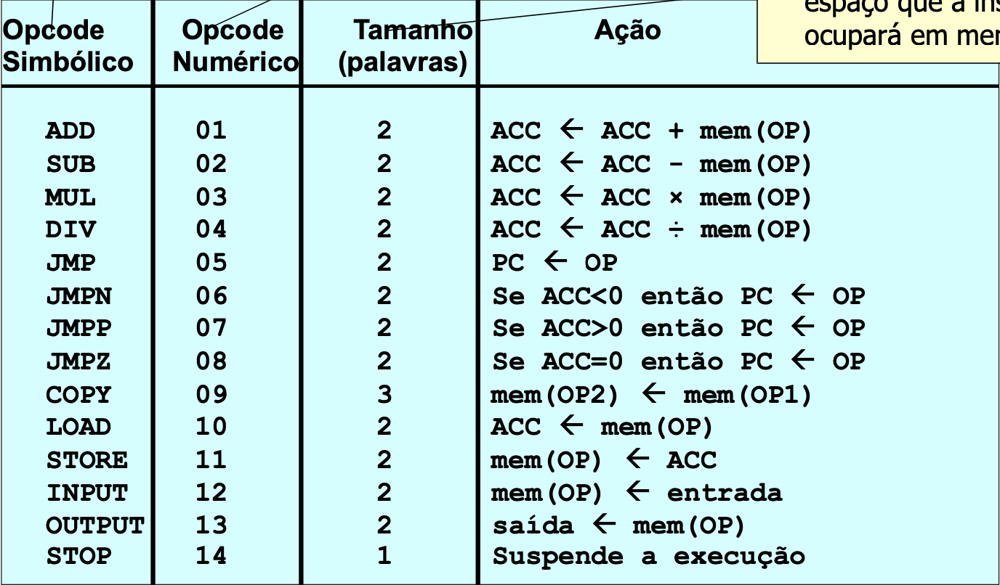

# Formato da .asm
O programa espera que o código assembly esteja no seguinte formato
primeiro: headers \
depois: .sections, onde: \
Headers:
```
mod:    begin
bar:    extern
        public foo
        public mod
```
.sections (qualquer ordem):
```
section .data
foo:    space
labl_2: const 5

section .text
        add foo
        .end
```

# Hypothetical Instruction Set
Here are the possible instrucitons for the program: \



# Compilando
A versão mínima para o cmake é a 3.17. A mais recente (3.20) deve funcionar normalmente.
Para compilar, no diretório root do projeto, escreva:
```
cmake . -B build
make -C build
```

É utilizada a versão `C++ 14` para compilar os arquivos

O comando `make clean -C build` deve remover todos os arquivos
e bibliotecas gerados pelo make

# Execução
Para execução, o montador espera que os arquivos assmebly
estejam no diretório `resource/test`

Dessa forma, a execução pode ser feita simplesmente chamando o arquivo assembly
pelo nome (SEM A ESPECIFICAÇÃO DO DIRETÓRIO)
1. `./Montador <nome(s)-do(s)-arquivo(s)>.asm`    (extensão ".asm" opcional)
2. `./Ligador <nome(s)-do(s)-arquivo(s)>.obj`   (extensão ".obj" opcional)
3. `./Simulador <nome-do-primero-arquivo-fornecido>.obj` (extensão ".obj" opcional)
### Exemplo
Considerando que temos dois arquivos `mod_a.asm` e `mod_b.asm` na pasta `resource/test`, após a compilação, basta executar
```
./montador test test2
./ligador test test2
./simulador test
```
# Saídas
### Montador
O montador recebe de 1 a 3 arquivos ".asm" e gera o mesmo número de arquivos ".obj" com nome `<nome-do-arquivo>.obj`.\
Automaticamente ele buscará pelos arquivos ".asm" no diretório `resource/test`\
Ao montar os arquivos ".obj", estes são armazenados no diretório `resource/object`

### Ligador
O Ligador recebe de 1 a 3 arquivos ".obj" e gera 1 arquivo ".obj" com nome `<nome-do-primeiro-arquivo>.obj`.\
Automaticamente ele buscará pelos arquivos ".obj" no diretório `resource/object`\
Ao montar o arquivo ".obj", este será armazenado no diretório `resource/link`

### Simulador
O Ligador recebe de 1 arquivo ".obj" e gera 1 arquivo ".out" com nome `<nome-do-primeiro-arquivo>.out`.\
Automaticamente ele buscará pelo arquivo ".obj" no diretório `resource/link`\
Ao gerar o arquivo ".out", este será armazenado no diretório `resource/out`

### Terminal
A saída no terminal representa os valores contidos em `ACC` e `PC` após a
execução de cada linha de instrução.

Também são impressos os valores
gerados pela instrucção `output`

